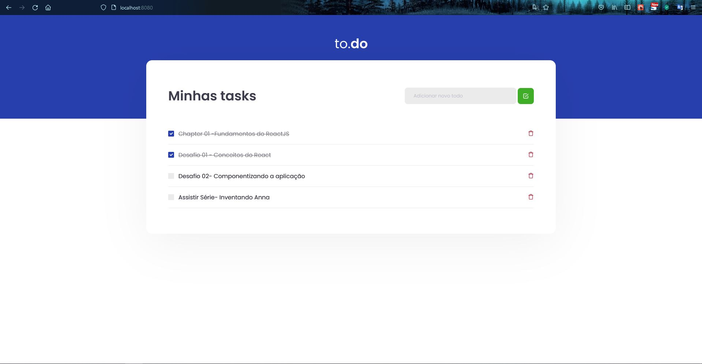
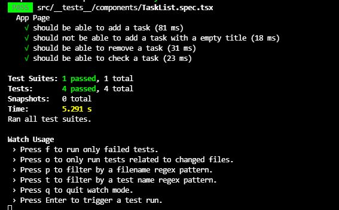
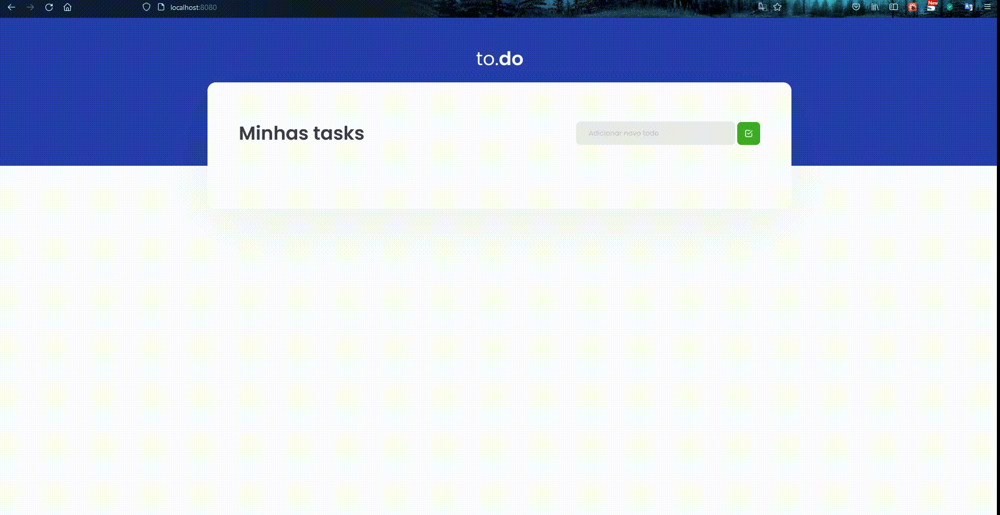

<h1 align="center">Ignite: Desafio 01 - Conceitos do React</h1>

## :bookmark_tabs: Desafio

    Utilizar o template disponibilizado e editar o arquivo src/components/TaskList.tsx, adicionando as funcionalidades 
    que permita o gerenciamento das tarefas. 
    
 > Funcionalidades 
  - Adicionar uma nova tarefa
  - Remover uma tarefa
  - Marcar e desmarcar uma tarefa como concluída
  
## :sparkler: Aplicação

## :white_check_mark: Testes

## Demonstração

   

